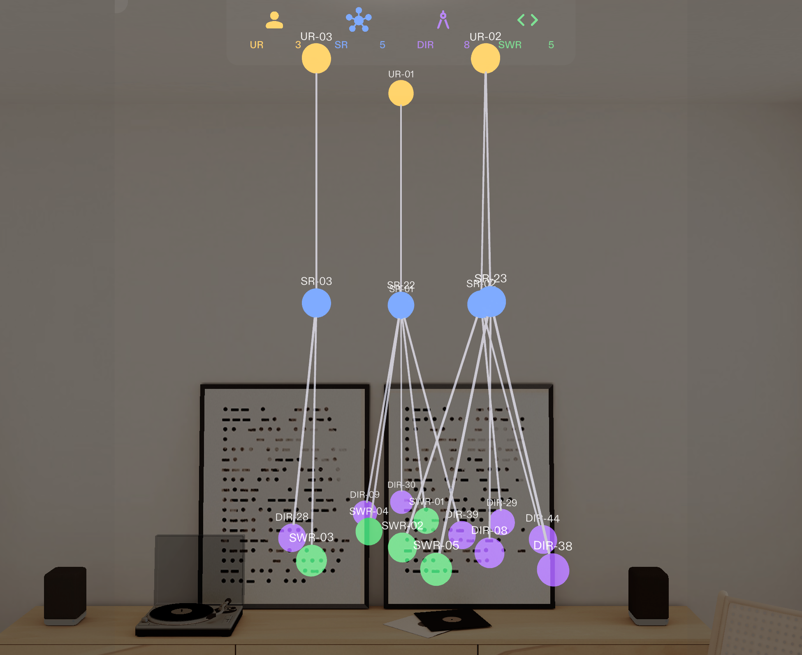
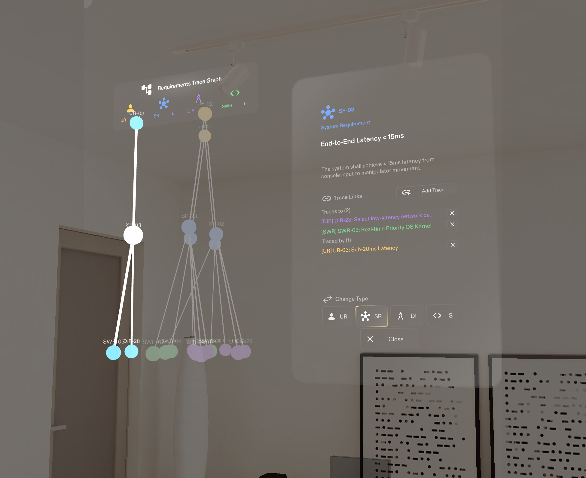

# maXR Organize

**maXR Organize** is a requirements-traceability platform for a V-model
hierarchy — **User Requirements → System Requirements → {Design Input
Requirements, Software Requirements}** — with three parts that all talk to
the same backend and stay in sync live:

| Part | What it is | README |
|---|---|---|
| **Backend** | Express/TypeScript REST + WebSocket API, JSON-file storage | [`maXR-Organize-Server/backend/README.md`](maXR-Organize-Server/backend/README.md) |
| **Frontend** | Angular 18 + Three.js web app — spreadsheet-style CRUD editor, traceability matrix, and an immersive 3D/WebXR graph (desktop + VR headset) | [`maXR-Organize-Server/frontend/README.md`](maXR-Organize-Server/frontend/README.md) |
| **Specs Lens** | Lens Studio (Spectacles AR) client — the same traceability graph as a real-world AR hologram | [`maXR-Organize/README.md`](maXR-Organize/README.md) |

All three clients read and write the same requirement records through the
backend's REST API, and all three can render the same underlying data —
in a browser, in VR, or projected into a room through AR glasses.
([`maXR-Organize-Server/README.md`](maXR-Organize-Server/README.md) is a
shorter, backend+frontend-only overview with quick-start steps and desktop
controls — useful if you don't need the Specs Lens.)





## Repository layout

```
Organize/
├── maXR-Organize/              — Lens Studio project (AR client)
│   └── README.md                 detailed docs: architecture, layout algorithm, known quirks
├── maXR-Organize-Server/
│   ├── README.md                — server-monorepo overview (backend + frontend only)
│   ├── backend/                — Express/TypeScript REST + WebSocket API
│   │   ├── README.md
│   │   ├── docs/openapi.yaml     Swagger spec, served live at /api-docs
│   │   ├── data/projects/        JSON-file data store (one folder per project)
│   │   └── src/                  routes/, services/, index.ts
│   └── frontend/               — Angular 18 + Three.js web app
│       ├── README.md
│       └── src/app/              components/, services/
└── docs/screenshots/           — screenshots used in this README
```

## The data model

Every requirement is one JSON record:

```json
{
  "id": "d46c37db-5c41-41cf-b92d-3de948af2d60",
  "name": "UR-01",
  "title": "Stereoscopic 3D Vision",
  "description": "The surgeon needs a high-definition 3D view of the surgical site...",
  "type": "UR",
  "traceLinks": ["6e81da9c-...", "0b235e36-..."]
}
```

- **`id`** — a server-generated UUID, the permanent identity of the record.
- **`name`** — a human-readable code (`UR-01`, `SR-14`, ...), regenerated
  whenever a requirement's type changes.
- **`type`** — one of `UR` / `SR` / `DIR` / `SWR`, following the strict
  hierarchy `UR → SR → {DIR, SWR}`.
- **`traceLinks`** — UUIDs of related requirements. **On the backend this is
  a bidirectional adjacency list**: the backend automatically keeps both
  ends of every link in sync, so a parent's `traceLinks` and a child's
  `traceLinks` each independently list the other. Each client is free to
  interpret/filter that list however suits its own model (see each
  sub-project's README for how it does so — the two are not identical).

Requirements of each type live in one of 4 per-project "files":
`user` (UR) / `system` (SR) / `design_input` (DIR) / `software` (SWR).

## Backend at a glance

Express 5 + TypeScript, no database — every project is a folder of JSON
files under `backend/data/projects/{projectId}/`. Full endpoint reference
and request/response shapes are in the
[backend README](maXR-Organize-Server/backend/README.md) and the live
Swagger UI (`/api-docs`) once the server is running; the short version:

```
GET    /api/projects
POST   /api/projects                                          { name }
DELETE /api/projects/:id

GET    /api/projects/:projectId/files/:fileType
POST   /api/projects/:projectId/files/:fileType                multipart upload (JSON or CSV) — full replace
POST   /api/projects/:projectId/files/:fileType/requirements
PUT    /api/projects/:projectId/files/:fileType/requirements/bulk
DELETE /api/projects/:projectId/files/:fileType/requirements/bulk
PUT    /api/projects/:projectId/files/:fileType/requirements/:reqId
DELETE /api/projects/:projectId/files/:fileType/requirements/:reqId
POST   /api/projects/:projectId/files/:fileType/requirements/:reqId/change-type   { newFileType }
```

`fileType` ∈ `user` | `system` | `design_input` | `software`.

A `ws` WebSocket server shares the same port and connection (no separate
path or auth) and broadcasts a JSON message on every mutation:
`PROJECT_CREATED`, `PROJECT_DELETED`, `FILE_REPLACED`,
`REQUIREMENT_CREATED`, `REQUIREMENT_UPDATED`, `REQUIREMENT_DELETED`,
`REQUIREMENT_TYPE_CHANGED`, `REQUIREMENTS_BULK_UPDATED`,
`REQUIREMENTS_BULK_DELETED`. Broadcasts fire from the route handlers right
after a write — there is no filesystem watcher, and no per-project/client
filtering (every connected client gets every event for every project).

**No authentication anywhere** — REST and WebSocket are both completely
open, and CORS allows any origin. This is a local/dev-only posture; don't
expose port 3000 to an untrusted network as-is.

### Run it

```bash
cd maXR-Organize-Server/backend
npm install
npm run dev      # nodemon + ts-node, http://localhost:3000
# or: npm run build && npm start
```

Swagger UI: `http://localhost:3000/api-docs` (note: the spec there is
missing a few routes that exist in code — see the endpoint list above for
the complete set).

## Frontend at a glance

Angular 18 (standalone components, Angular Material, no NgRx — plain
component state + RxJS) with a Three.js-powered 3D/WebXR view. Full detail
in the [frontend README](maXR-Organize-Server/frontend/README.md); what it
lets you do:

- **Dashboard** — create/delete projects.
- **Project details** — 4 requirement-type cards, JSON/CSV upload (full
  replace) per type, links into the editor / matrix / 3D graph.
- **Requirement editor** (`/projects/:id/editor/:fileType`) — spreadsheet-
  style Material table: inline edit, bulk select/edit/delete, resizable
  columns (persisted to `localStorage`), and `traceLinks` editing via
  multi-select dropdowns.
- **Traceability matrix** (`/projects/:id/matrix`) — read-only hierarchical
  tree across all 4 types, plus an "orphaned requirements" section for
  anything not linked into the tree.
- **3D graph** (`/projects/:id/3d-graph`) — the same traceability graph as
  the Specs Lens, rendered in Three.js: concentric/circular 3-tier layout,
  colored by type, selecting a node dims everything not in its trace chain
  ("Focus Mode"). Works on desktop (orbit + WASD/QE flight controls) and in
  a WebXR headset (Oculus hand-tracking, pinch-to-select, a wrist-mounted
  detail panel).

It talks to the backend at `http://{same host}:3000` (hardcoded, not an
Angular environment file) and listens on
`ws://{same host}:3000/sync/projects/{projectId}` purely as a "something
changed, refetch over REST" signal — it never applies a pushed payload
directly, and it never sends anything itself.

Note: the backend exposes a `change-type` endpoint (move a requirement
between types) that the frontend's `ProjectService` already wraps but no
UI currently calls — a capability gap between the two, worth knowing if
you go looking for that button.

### Run it

```bash
cd maXR-Organize-Server/frontend
npm install
npm start          # ng serve, http://localhost:4200
```

WebXR (VR headset testing) needs a secure context:

```bash
npx @angular/cli serve --host 0.0.0.0 --ssl true
# desktop:  https://localhost:4200
# headset:  https://<your-LAN-IP>:4200
```

The backend must be running on port 3000 on the same host for either mode
to load real data.

## Specs Lens at a glance

A Lens Studio (Spectacles AR) client rendering the identical traceability
graph as a real-world hologram: tap a node to select it, reassign its type,
add/remove trace links — all persisted back to the backend and live-synced
via the same WebSocket. Full architecture, the radial layout algorithm, and
a "known quirks" section documenting real bugs found and fixed during
development (hover-tooltip flicker, a renaming bug, a UI-reflow bug) are in
the [Specs Lens README](maXR-Organize/README.md).

Unlike the frontend, the Lens client keeps its own `traceLinks` **strictly
downward-only and hierarchy-filtered** in memory (not the backend's raw
bidirectional adjacency list) — worth reading if you're comparing the two
clients' data-handling code side by side.

### Run it

Open `maXR-Organize/maXR-Organize.esproj` in Lens Studio and start the
preview. It looks for the backend at `http://localhost:3000` /
`ws://localhost:3000` on start, and **falls back to a bundled demo dataset**
(a fictional "Telesurgery Robot" project — the same shape the backend's
sample project uses) if the backend isn't reachable, so the Lens is usable
standalone for UI/layout work without the server running.

## Running the whole thing together

```bash
# terminal 1
cd maXR-Organize-Server/backend && npm install && npm run dev

# terminal 2
cd maXR-Organize-Server/frontend && npm install && npm start

# Lens Studio: open maXR-Organize/maXR-Organize.esproj, start the preview
```

With the backend running, the Angular app, the Lens preview, and (once
deployed) a real pair of Spectacles can all have the same project open at
once — edit a requirement in any one of them and the others pick it up
live over their respective WebSocket connections, typically within a
second or two.

## Cross-client caveats worth knowing

- **`traceLinks` semantics differ by client.** The backend stores it as a
  flat, bidirectional adjacency list (both ends of a link independently
  list each other). The frontend reads/writes it directly in that raw
  shape. The Specs Lens filters it down to a strict downward-only,
  hierarchy-valid view in its own memory, and re-derives the correct
  bidirectional writes when persisting an edit back (see the Specs Lens
  README's "undirected-adjacency-list quirk" section) — don't assume the
  two clients' in-memory models are interchangeable.
- **No authentication anywhere**, on any of the three parts. Treat this as
  a local/trusted-network stack.
- **The backend's OpenAPI spec undersells the API** — several routes that
  exist in `src/routes/` (single-requirement create, both bulk routes,
  `change-type`) aren't in `docs/openapi.yaml`. Use the endpoint tables in
  this README / the backend README, not just Swagger, as the source of
  truth.
- **A "requirement type change" capability exists on the backend and in
  the Lens client's UI, but has no button in the Angular frontend today.**
